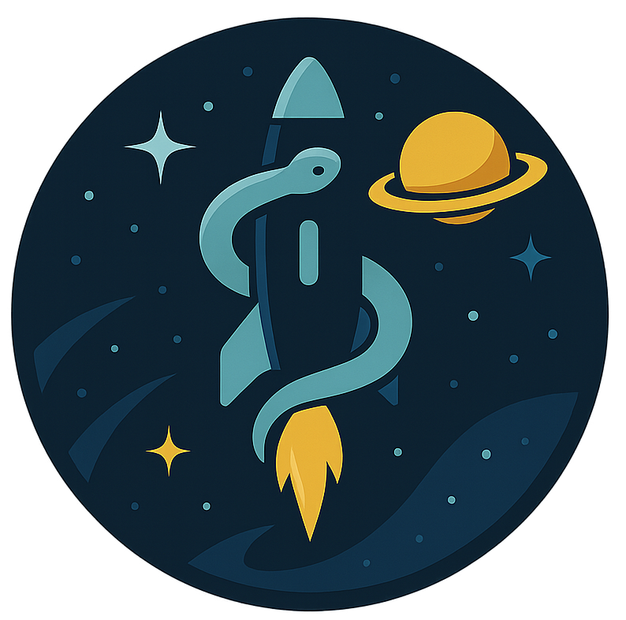

<div align="center">
  
  
  # 🚀 AstroCode Web
  
  **Aplicación web frontend para la plataforma AstroCode**
  
  Una moderna interfaz de usuario construida con React para gestionar y visualizar proyectos de programación.
</div>

## 📋 Descripción

AstroCode Web es la interfaz frontend de la plataforma AstroCode, diseñada para proporcionar una experiencia de usuario intuitiva y moderna. La aplicación permite a los usuarios:

- 🔐 **Autenticación**: Sistema de login y registro seguro
- 👤 **Gestión de usuarios**: Perfiles y configuraciones personalizadas
- 📊 **Dashboard**: Panel de control con métricas y estadísticas
- 🎨 **Interfaz moderna**: Diseño responsive y atractivo

## 🛠️ Tecnologías

- **React 18** - Framework frontend
- **TypeScript** - Tipado estático
- **CSS3** - Estilos y animaciones
- **GraphQL** - Comunicación con la API

## 🚀 Instalación y Configuración

### Prerrequisitos

- Node.js (versión 16 o superior)
- npm o yarn
- Git

### Pasos de instalación

1. **Clonar el repositorio**
   ```bash
   git clone <url-del-repositorio>
   cd Astrocode-web
   ```

2. **Instalar dependencias**
   ```bash
   cd client
   npm install
   ```

3. **Configurar variables de entorno**
   ```bash
   # Crear archivo .env en la carpeta client
   REACT_APP_API_URL=http://localhost:4001/graphql
   ```

4. **Iniciar el servidor de desarrollo**
   ```bash
   npm start
   ```

5. **Abrir en el navegador**
   ```
   http://localhost:3001
   ```

## 📁 Estructura del Proyecto

```
Astrocode-web/
├── client/                 # Aplicación React
│   ├── public/            # Archivos estáticos
│   ├── src/               # Código fuente
│   │   ├── views/         # Componentes de vistas
│   │   │   └── login/     # Sistema de autenticación
│   │   └── ...            # Otros componentes
│   ├── package.json       # Dependencias del cliente
│   └── tsconfig.json      # Configuración TypeScript
├── img/                   # Recursos de imagen
├── README.md              # Este archivo
└── package.json           # Configuración del proyecto
```

## 🔧 Scripts Disponibles

```bash
# Iniciar servidor de desarrollo
npm start

# Construir para producción
npm run build

# Ejecutar tests
npm test

# Analizar bundle
npm run analyze
```

## 🌐 Conexión con la API

La aplicación web se conecta con la API de AstroCode a través de GraphQL. Asegúrate de que la API esté ejecutándose en `http://localhost:4001` antes de iniciar el frontend.

## 🤝 Contribución

1. Fork el proyecto
2. Crea una rama para tu feature (`git checkout -b feature/AmazingFeature`)
3. Commit tus cambios (`git commit -m 'Add some AmazingFeature'`)
4. Push a la rama (`git push origin feature/AmazingFeature`)
5. Abre un Pull Request

## 📝 Licencia

Este proyecto está bajo la Licencia MIT - ver el archivo [LICENSE](LICENSE) para más detalles.

## 👥 Equipo

Desarrollado con ❤️ por el equipo de AstroCode

---

<div align="center">
  <strong>🚀 ¡Explora el universo del código con AstroCode! 🌟</strong>
</div>